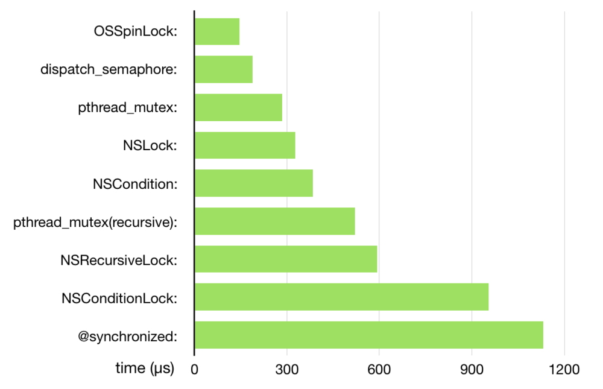

# iOS开发中锁的种类
  
- [iOS开发中锁的种类](#ios%E5%BC%80%E5%8F%91%E4%B8%AD%E9%94%81%E7%9A%84%E7%A7%8D%E7%B1%BB)
  - [什么是锁？](#%E4%BB%80%E4%B9%88%E6%98%AF%E9%94%81)
    - [锁的种类有哪些？](#%E9%94%81%E7%9A%84%E7%A7%8D%E7%B1%BB%E6%9C%89%E5%93%AA%E4%BA%9B)
      - [OSSpinLock](#osspinlock)
      - [dispatch_semaphore](#dispatchsemaphore)
      - [pthread_mutex](#pthreadmutex)
      - [pthread_mutex(recursive)](#pthreadmutexrecursive)
      - [NSLock](#nslock)
      - [NSCondition](#nscondition)
      - [NSRecursiveLock](#nsrecursivelock)
      - [@synchronized](#synchronized)
      - [NSConditionLock](#nsconditionlock)

## 什么是锁？

我们在使用多线程的时候多个线程可能会访问同一块资源，这样就很容易引发数据错乱和数据安全等问题，这时候就需要我们保证每次只有一个线程访问这一块资源，锁 应运而生。

### 锁的种类有哪些？

常见的锁有如下几种,性能比较如下

+ OSSpinLock[(已经不再安全)](https://www.jianshu.com/go-wild?ac=2&url=http%3A%2F%2Fblog.ibireme.com%2F)
+ dispatch_semaphore
+ pthread_mutex
+ pthread_mutex(recursive)
+ NSLock
+ NSCondition
+ @synchronized
+ NSConditionLock
  

#### OSSpinLock

How to use it ?

    __block OSSpinLock oslock = OS_SPINLOCK_INIT;
    //线程1
    dispatch_async(dispatch_get_global_queue(DISPATCH_QUEUE_PRIORITY_DEFAULT, 0), ^{
        NSLog(@"线程1 准备上锁");
        OSSpinLockLock(&oslock);
        sleep(4);
        NSLog(@"线程1");
        OSSpinLockUnlock(&oslock);
        NSLog(@"线程1 解锁成功");
        NSLog(@"--------------------------------------------------------");
    });

    //线程2
    dispatch_async(dispatch_get_global_queue(DISPATCH_QUEUE_PRIORITY_DEFAULT, 0), ^{
        NSLog(@"线程2 准备上锁");
        OSSpinLockLock(&oslock);
        NSLog(@"线程2");
        OSSpinLockUnlock(&oslock);
        NSLog(@"线程2 解锁成功");
    });

About `OSSpinLock` You should know

> 在 OSSpinLock1 图中可以发现：当我们锁住线程1时，在同时锁住线程2的情况下，线程2会一直等待（自旋锁不会让等待的进入睡眠状态），直到线程1的任务执行完且解锁完毕，线程2会立即执行；而在 OSSpinLock2 图中，因为我们注释掉了线程1中的解锁代码，会绕过线程1，直到调用了线程2的解锁方法才会继续执行线程1中的任务，正常情况下，lock和unlock最好成对出现。   
> 
> OS_SPINLOCK_INIT： 默认值为 0,在 locked 状态时就会大于 0，unlocked状态下为 0
> OSSpinLockLock(&oslock)：上锁，参数为 OSSpinLock 地址
> OSSpinLockUnlock(&oslock)：解锁，参数为 OSSpinLock 地址
> OSSpinLockTry(&oslock)：尝试加锁，可以加锁则立即加锁并返回 YES,反之返回 NO
> 这里顺便提一下trylock和lock使用场景：   
> 当前线程锁失败，也可以继续其它任务，用 trylock 合适
> 当前线程只有锁成功后，才会做一些有意义的工作，那就 lock，没必要轮询 trylock

#### dispatch_semaphore

How to use it ?

    dispatch_semaphore_t signal = dispatch_semaphore_create(1); //传入值必须 >=0, 若传入为0则阻塞线程并等待timeout,时间到后会执行其后的语句
    dispatch_time_t overTime = dispatch_time(DISPATCH_TIME_NOW, 3.0f * NSEC_PER_SEC);

    //线程1
    dispatch_async(dispatch_get_global_queue(DISPATCH_QUEUE_PRIORITY_DEFAULT, 0), ^{
        NSLog(@"线程1 等待ing");
        dispatch_semaphore_wait(signal, overTime); //signal 值 -1
        NSLog(@"线程1");
        dispatch_semaphore_signal(signal); //signal 值 +1
        NSLog(@"线程1 发送信号");
        NSLog(@"--------------------------------------------------------");
    });

    //线程2
    dispatch_async(dispatch_get_global_queue(DISPATCH_QUEUE_PRIORITY_DEFAULT, 0), ^{
        NSLog(@"线程2 等待ing");
        dispatch_semaphore_wait(signal, overTime);
        NSLog(@"线程2");
        dispatch_semaphore_signal(signal);
        NSLog(@"线程2 发送信号");
    });

About `dispatch_semaphore` You should know

> dispatch_semaphore_create(1)： 传入值必须 >=0, 若传入为 0 则阻塞线程并等待timeout,时间到后会执行其后的语句
> dispatch_semaphore_wait(signal, overTime)：可以理解为 lock,会使得 signal 值 -1
> dispatch_semaphore_signal(signal)：可以理解为 unlock,会使得 signal 值 +1   
>
> 关于信号量，我们可以用停车来比喻：
>
> 停车场剩余4个车位，那么即使同时来了四辆车也能停的下。如果此时来了五辆车，那么就有一辆需要等待。
> 信号量的值（signal）就相当于剩余车位的数目，dispatch_semaphore_wait 函数就相当于来了一辆车， dispatch_semaphore_signal 就相当于走了一辆车。停车位的剩余数目在初始化的时候就已经指明了（dispatch_semaphore_create（long value）），调用一次 dispatch_semaphore_signal，剩余的车位就增加一个；调用一次dispatch_semaphore_wait 剩余车位就减少一个；当剩余车位为 0 时，再来车（即调用 dispatch_semaphore_wait）就只能等待。有可能同时有几辆车等待一个停车位。有些车主没有耐心，给自己设定了一段等待时间，这段时间内等不到停车位就走了，如果等到了就开进去停车。而有些车主就像把车停在这，所以就一直 等下去。

#### pthread_mutex

How to use it ?

    static pthread_mutex_t pLock;
    pthread_mutex_init(&pLock, NULL);
    //1.线程1
    dispatch_async(dispatch_get_global_queue(DISPATCH_QUEUE_PRIORITY_DEFAULT, 0), ^{
        NSLog(@"线程1 准备上锁");
        pthread_mutex_lock(&pLock);
        sleep(3);
        NSLog(@"线程1");
        pthread_mutex_unlock(&pLock);
    });

    //1.线程2
    dispatch_async(dispatch_get_global_queue(DISPATCH_QUEUE_PRIORITY_DEFAULT, 0), ^{
        NSLog(@"线程2 准备上锁");
        pthread_mutex_lock(&pLock);
        NSLog(@"线程2");
        pthread_mutex_unlock(&pLock);
    });

About `pthread_mutex` You should know

> pthread_mutex 中也有个pthread_mutex_trylock(&pLock)，和上面提到的 OSSpinLockTry(&oslock)区别在于，前者可以加锁时返回的是 0，否则返回一个错误提示码；后者返回的 YES和NO

#### pthread_mutex(recursive)

How to use it ?

    static pthread_mutex_t pLock;
    pthread_mutexattr_t attr;
    pthread_mutexattr_init(&attr); //初始化attr并且给它赋予默认
    pthread_mutexattr_settype(&attr, PTHREAD_MUTEX_RECURSIVE); //设置锁类型，这边是设置为递归锁
    pthread_mutex_init(&pLock, &attr);
    pthread_mutexattr_destroy(&attr); //销毁一个属性对象，在重新进行初始化之前该结构不能重新使用

    //1.线程1
    dispatch_async(dispatch_get_global_queue(DISPATCH_QUEUE_PRIORITY_DEFAULT, 0), ^{
        static void (^RecursiveBlock)(int);
        RecursiveBlock = ^(int value) {
            pthread_mutex_lock(&pLock);
            if (value > 0) {
                NSLog(@"value: %d", value);
                RecursiveBlock(value - 1);
            }
            pthread_mutex_unlock(&pLock);
        };
        RecursiveBlock(5);
    });

About `pthread_mutex(recursive)` You should know

>pthread_mutex 中也有个pthread_mutex_trylock(&pLock)，和上面提到的 OSSpinLockTry(&oslock)区别在于，前者可以加锁时返回的是 0，否则返回一个错误提示码；后者返回的 YES和NO

#### NSLock

How to use

    NSLock *lock = [NSLock new];
    //线程1
    dispatch_async(dispatch_get_global_queue(DISPATCH_QUEUE_PRIORITY_DEFAULT, 0), ^{
        NSLog(@"线程1 尝试加速ing...");
        [lock lock];
        sleep(3);//睡眠5秒
        NSLog(@"线程1");
        [lock unlock];
        NSLog(@"线程1解锁成功");
    });

    //线程2
    dispatch_async(dispatch_get_global_queue(DISPATCH_QUEUE_PRIORITY_DEFAULT, 0), ^{
        NSLog(@"线程2 尝试加速ing...");
        BOOL x =  [lock lockBeforeDate:[NSDate dateWithTimeIntervalSinceNow:4]];
        if (x) {
            NSLog(@"线程2");
            [lock unlock];
        }else{
            NSLog(@"失败");
        }
    });

About `NSLock` You should know

> lock、unlock：不多做解释，和上面一样
trylock：能加锁返回 YES 并执行加锁操作，相当于 lock，反之返回 NO
** lockBeforeDate：这个方法表示会在传入的时间内尝试加锁，若能加锁则执行加锁**操作并返回 YES，反之返回 NO

#### NSCondition

How to use

    NSCondition *cLock = [NSCondition new];
    //线程1
    dispatch_async(dispatch_get_global_queue(DISPATCH_QUEUE_PRIORITY_DEFAULT, 0), ^{
        NSLog(@"start");
        [cLock lock];
        [cLock waitUntilDate:[NSDate dateWithTimeIntervalSinceNow:2]];
        NSLog(@"线程1");
        [cLock unlock];
    });

    NSCondition *cLock = [NSCondition new];
    //线程1
    dispatch_async(dispatch_get_global_queue(DISPATCH_QUEUE_PRIORITY_DEFAULT, 0), ^{
        [cLock lock];
        NSLog(@"线程1加锁成功");
        [cLock wait];
        NSLog(@"线程1");
        [cLock unlock];
    });

    //线程2
    dispatch_async(dispatch_get_global_queue(DISPATCH_QUEUE_PRIORITY_DEFAULT, 0), ^{
        [cLock lock];
        NSLog(@"线程2加锁成功");
        [cLock wait];
        NSLog(@"线程2");
        [cLock unlock];
    });

    dispatch_async(dispatch_get_global_queue(DISPATCH_QUEUE_PRIORITY_DEFAULT, 0), ^{
        sleep(2);
        NSLog(@"唤醒一个等待的线程");
        [cLock signal];
    });

About `NSCondition` You should know

> wait：进入等待状态
waitUntilDate:：让一个线程等待一定的时间
signal：唤醒一个等待的线程
broadcast：唤醒所有等待的线程

#### NSRecursiveLock

How to use

    NSLock *rLock = [NSLock new];
    dispatch_async(dispatch_get_global_queue(DISPATCH_QUEUE_PRIORITY_DEFAULT, 0), ^{
        static void (^RecursiveBlock)(int);
        RecursiveBlock = ^(int value) {
            [rLock lock];
            if (value > 0) {
                NSLog(@"线程%d", value);
                RecursiveBlock(value - 1);
            }
            [rLock unlock];
        };
        RecursiveBlock(4);
    });

About `NSRecursiveLock` You should know

> 递归锁可以被同一线程多次请求，而不会引起死锁。这主要是用在循环或递归操作中。

#### @synchronized

How to use

    //线程1
    dispatch_async(dispatch_get_global_queue(DISPATCH_QUEUE_PRIORITY_DEFAULT, 0), ^{
        @synchronized (self) {
            sleep(2);
            NSLog(@"线程1");
        }
    });

    //线程2
    dispatch_async(dispatch_get_global_queue(DISPATCH_QUEUE_PRIORITY_DEFAULT, 0), ^{
        @synchronized (self) {
            NSLog(@"线程2");
        }
    });

About `@synchronized` You should know

> @synchronized 相信大家应该都熟悉，它的用法应该算这些锁中最简单的:

#### NSConditionLock

How to use

    NSConditionLock *cLock = [[NSConditionLock alloc] initWithCondition:0];

    //线程1
    dispatch_async(dispatch_get_global_queue(DISPATCH_QUEUE_PRIORITY_DEFAULT, 0), ^{
        if([cLock tryLockWhenCondition:0]){
            NSLog(@"线程1");
        [cLock unlockWithCondition:1];
        }else{
            NSLog(@"失败");
        }
    });

    //线程2
    dispatch_async(dispatch_get_global_queue(DISPATCH_QUEUE_PRIORITY_DEFAULT, 0), ^{
        [cLock lockWhenCondition:3];
        NSLog(@"线程2");
        [cLock unlockWithCondition:2];
    });

    //线程3
    dispatch_async(dispatch_get_global_queue(DISPATCH_QUEUE_PRIORITY_DEFAULT, 0), ^{
        [cLock lockWhenCondition:1];
        NSLog(@"线程3");
        [cLock unlockWithCondition:3];
    });

About `NSConditionLock` You should know

> 我们在初始化 NSConditionLock 对象时，给了他的标示为 0
执行 tryLockWhenCondition:时，我们传入的条件标示也是 0,所 以线程1 加锁成功
执行 unlockWithCondition:时，这时候会把condition由 0 修改为 1
因为condition  修改为了  1， 会先走到 线程3，然后 线程3 又将 condition 修改为 3
最后 走了 线程2 的流程
从上面的结果我们可以发现，NSConditionLock 还可以实现任务之间的依赖。
